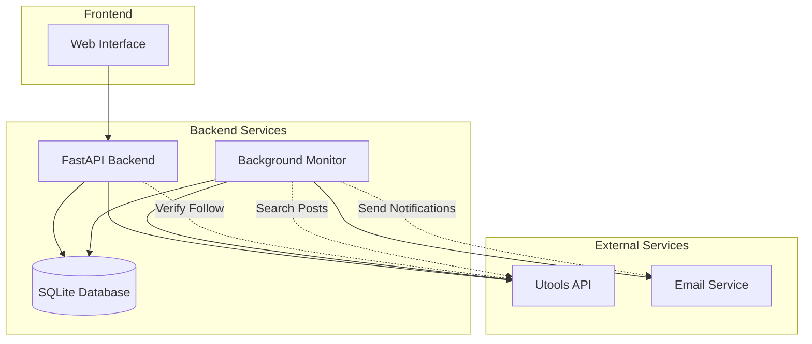

# Design Document

## Overview

The Comet Invitation Hunter is a web-based service that monitors X (Twitter) for Comet browser invitation links and notifies verified followers via email. The system consists of a simple web frontend for user onboarding, a backend API for user verification, and a background monitoring service that continuously searches for invitation posts.

The architecture follows a microservices approach with three main components:
1. **Web Frontend**: Simple HTML/CSS/TypeScript interface for email collection and X verification
2. **Backend API**: Python FastAPI service handling user verification and data storage
3. **Background Monitor**: Python service that continuously monitors X and sends email notifications

## Architecture



## Components and Interfaces

### 1. Web Frontend
- **Technology**: HTML/CSS/TypeScript with Vite for build tooling
- **Purpose**: User interface for email collection and X verification
- **Key Features**:
  - Email input form with TypeScript validation
  - X verification flow with instructions
  - Success/error message display
  - Responsive design for mobile/desktop
- **Build Tool**: Vite for fast development and TypeScript compilation

### 2. Backend API (Python FastAPI)
- **Technology**: Python with FastAPI framework
- **Purpose**: Handle user verification and data management
- **Key Endpoints**:
  - `POST /api/users/verify` - Verify user follows @0xSky99 and store email
  - `GET /api/health` - Health check endpoint
- **Dependencies**:
  - `requests` - HTTP client for Utools API
  - `sqlalchemy` - Database ORM
  - `pydantic` - Data validation

### 3. Background Monitor (Python)
- **Technology**: Python with asyncio for concurrent processing
- **Purpose**: Continuously monitor X for invitation posts and send notifications
- **Key Functions**:
  - Search X using multiple keywords simultaneously
  - Deduplicate posts across keyword searches
  - Classify posts as free or conditional sharing
  - Batch and send email notifications
- **Dependencies**:
  - `requests` - HTTP client for Utools API
  - `smtplib` or email service SDK
  - `asyncio` - Concurrent processing

### 4. Database (SQLite)
- **Technology**: SQLite for MVP simplicity
- **Purpose**: Store user emails and processed posts
- **Tables**: See Data Models section

## Data Models

### Users Table
```sql
CREATE TABLE users (
    id INTEGER PRIMARY KEY AUTOINCREMENT,
    email VARCHAR(255) UNIQUE NOT NULL,
    verified_at TIMESTAMP DEFAULT CURRENT_TIMESTAMP,
    created_at TIMESTAMP DEFAULT CURRENT_TIMESTAMP
);
```

### Posts Table
```sql
CREATE TABLE posts (
    id INTEGER PRIMARY KEY AUTOINCREMENT,
    tweet_id VARCHAR(50) UNIQUE NOT NULL,
    content TEXT NOT NULL,
    author_username VARCHAR(50) NOT NULL,
    post_type VARCHAR(20) NOT NULL, -- 'free' or 'conditional'
    invitation_link TEXT,
    tweet_url VARCHAR(255) NOT NULL,
    created_at TIMESTAMP DEFAULT CURRENT_TIMESTAMP,
    processed_at TIMESTAMP DEFAULT CURRENT_TIMESTAMP
);
```

### Email Logs Table
```sql
CREATE TABLE email_logs (
    id INTEGER PRIMARY KEY AUTOINCREMENT,
    batch_id VARCHAR(50) NOT NULL,
    recipient_count INTEGER NOT NULL,
    posts_included INTEGER NOT NULL,
    sent_at TIMESTAMP DEFAULT CURRENT_TIMESTAMP,
    status VARCHAR(20) DEFAULT 'sent' -- 'sent', 'failed', 'retrying'
);
```

## Key Algorithms

### 1. X Post Monitoring Algorithm (Using Utools API)
```python
API_KEY = "your_utools_api_key_here"
BASE_URL = "https://twitter.good6.top/api/base/apitools"

async def monitor_posts():
    keywords = [
        "perplexity.ai/browser/claim",
        "comet invitation", 
        "comet invite",
        "comet browser invite",
        "comet access"
    ]
    
    # Step 1: Search with all keywords simultaneously using /search
    all_posts = []
    for keyword in keywords:
        response = requests.get(
            f"{BASE_URL}/search",
            params={
                "words": keyword,
                "product": "Latest",
                "count": 50,
                "apiKey": API_KEY
            }
        )
        
        if response.status_code == 200:
            response_data = response.json()
            if response_data.get("code") == 1:
                # Parse the nested JSON string in the "data" field
                search_data = json.loads(response_data["data"])
                posts = parse_search_results(search_data)
                all_posts.extend(posts)
    
    # Step 2: Deduplicate by tweet_id
    unique_posts = deduplicate_posts(all_posts)
    
    # Step 3: Process each post individually
    new_posts = []
    for post in unique_posts:
        if not is_already_processed(post["id_str"]):
            classified_post = classify_post(post)
            if classified_post:  # Only store valid invitation posts
                store_post(classified_post)
                new_posts.append(classified_post)
    
    # Step 4: Send batch notification if new posts found
    if new_posts:
        send_batch_notification(new_posts)

def parse_search_results(search_data):
    """Parse complex Utools search response to extract tweet data"""
    posts = []
    
    try:
        timeline = search_data["data"]["search_by_raw_query"]["search_timeline"]["timeline"]
        
        for instruction in timeline["instructions"]:
            if instruction["type"] == "TimelineAddEntries":
                for entry in instruction["entries"]:
                    if entry["entryId"].startswith("tweet-"):
                        tweet_result = entry["content"]["itemContent"]["tweet_results"]["result"]
                        if tweet_result["__typename"] == "Tweet":
                            posts.append({
                                "id_str": tweet_result["rest_id"],
                                "full_text": tweet_result["legacy"]["full_text"],
                                "user": {
                                    "screen_name": tweet_result["core"]["user_results"]["result"]["legacy"]["screen_name"],
                                    "id_str": tweet_result["core"]["user_results"]["result"]["rest_id"]
                                },
                                "created_at": tweet_result["legacy"]["created_at"]
                            })
    except KeyError as e:
        logger.error(f"Error parsing search results: {e}")
    
    return posts

def deduplicate_posts(posts):
    """Remove duplicate posts by tweet ID"""
    seen_ids = set()
    unique_posts = []
    for post in posts:
        if post["id_str"] not in seen_ids:
            seen_ids.add(post["id_str"])
            unique_posts.append(post)
    return unique_posts
```

### 2. Post Classification Algorithm
```python
def classify_post(post):
    content = post["full_text"].lower()
    original_content = post["full_text"]
    
    # Check for direct Comet invitation links
    invitation_patterns = [
        r'https://www\.perplexity\.ai/browser/claim/[A-Z0-9]+',
        r'perplexity\.ai/browser/claim/[A-Z0-9]+',
        r'comet.*invitation',
        r'comet.*invite',
        r'comet.*access'
    ]
    
    for pattern in invitation_patterns:
        if re.search(pattern, content):
            extracted_link = extract_invitation_link(original_content)
            return {
                'tweet_id': post["id_str"],
                'content': original_content,
                'author_username': post["user"]["screen_name"],
                'type': 'free',
                'invitation_link': extracted_link,
                'tweet_url': f"https://x.com/{post['user']['screen_name']}/status/{post['id_str']}",
                'conditions': None
            }
    
    # Check for conditional sharing indicators
    conditional_keywords = ['dm me', 'follow and dm', 'comment below', 'retweet and dm', 'follow for invite']
    if any(keyword in content for keyword in conditional_keywords):
        # Also check if it mentions comet
        comet_keywords = ['comet', 'perplexity browser', 'ai browser']
        if any(comet_keyword in content for comet_keyword in comet_keywords):
            return {
                'tweet_id': post["id_str"],
                'content': original_content,
                'author_username': post["user"]["screen_name"],
                'type': 'conditional',
                'invitation_link': None,
                'tweet_url': f"https://x.com/{post['user']['screen_name']}/status/{post['id_str']}",
                'conditions': extract_conditions(original_content)
            }
    
    return None  # Not an invitation post

def extract_invitation_link(content):
    """Extract Comet invitation link from post content"""
    pattern = r'https://www\.perplexity\.ai/browser/claim/[A-Z0-9]+'
    match = re.search(pattern, content)
    return match.group(0) if match else None

def extract_conditions(content):
    """Extract sharing conditions from conditional posts"""
    conditions = []
    if 'dm me' in content.lower():
        conditions.append('Send DM to author')
    if 'follow' in content.lower():
        conditions.append('Follow the author')
    if 'comment' in content.lower():
        conditions.append('Comment on the post')
    if 'retweet' in content.lower():
        conditions.append('Retweet the post')
    return ', '.join(conditions) if conditions else 'Check post for requirements'
```

### 3. X Follower Verification (Using Utools API)
```python
async def verify_user_follows(user_handle):
    try:
        # Step 1: Get user ID from handle using /userByScreenNameV2
        user_response = requests.get(
            f"{BASE_URL}/userByScreenNameV2",
            params={
                "screen_name": user_handle,
                "apiKey": API_KEY
            }
        )
        
        if user_response.status_code != 200 or user_response.json().get("code") != 1:
            return False
            
        # Parse the nested JSON string in the "data" field
        user_data = json.loads(user_response.json()["data"])
        user_id = user_data["data"]["user"]["result"]["rest_id"]
        
        # Step 2: Get @0xSky99's followers using /followersids
        followers_response = requests.get(
            f"{BASE_URL}/followersids",
            params={
                "user_id": "1260183271930904577",  # @0xSky99's ID
                "apiKey": API_KEY
            }
        )
        
        if followers_response.status_code != 200 or followers_response.json().get("code") != 1:
            return False
            
        # Parse the nested JSON string in the "data" field
        followers_data = json.loads(followers_response.json()["data"])
        follower_ids = followers_data["ids"]
        
        # Step 3: Check if user_id is in the followers list
        return int(user_id) in follower_ids
        
    except Exception as e:
        logger.error(f"Verification failed: {e}")
        return False
```

## Error Handling

### API Rate Limiting
- Implement exponential backoff for Utools API calls
- Queue requests when rate limits are reached
- Monitor Utools API response codes for rate limiting
- Use different rate limit buckets for search vs. follower verification

### Database Failures
- Retry database operations up to 3 times with exponential backoff
- Log all database errors for debugging
- Graceful degradation when database is unavailable

### Email Delivery Failures
- Retry failed email sends up to 3 times
- Log all email delivery attempts and results
- Continue monitoring even if email service is down

## Testing Strategy

### Unit Tests
- **Backend API**: Test all endpoints with mock X API responses
- **Post Classification**: Test algorithm with various post content examples
- **Database Operations**: Test CRUD operations with test database
- **Email Service**: Test email formatting and sending with mock service

### Integration Tests
- **End-to-End Flow**: Test complete user journey from email submission to notification
- **Background Monitor**: Test full monitoring cycle with controlled test data

### Manual Testing
- **User Interface**: Test web form functionality across browsers
- **X Verification**: Test with real X accounts that follow/don't follow @0xSky99
- **Email Notifications**: Verify email content and formatting

## Deployment Considerations

### Environment Configuration
- Utools API key: `your_utools_api_key_here`
- Email service configuration (SMTP or service API keys)
- Database connection string
- Frontend URL for CORS configuration

### Monitoring and Logging
- Application logs for debugging
- Email delivery success/failure rates
- Database performance metrics

### Security
- HTTPS for all web traffic
- Secure storage of API credentials
- Input validation for all user inputs
- SQL injection prevention through ORM usage