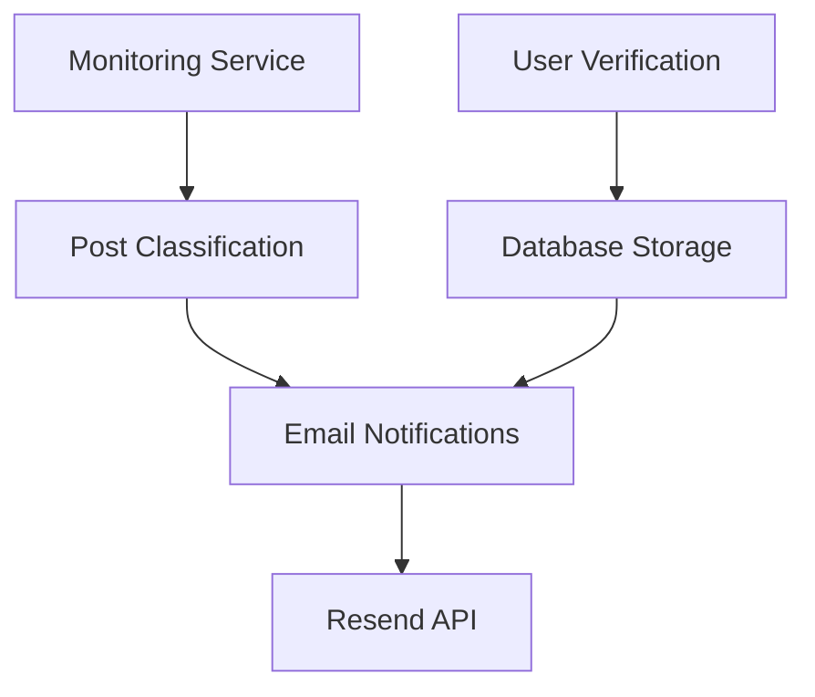

# Design Document

## Overview

The email notification system has three main issues that need to be addressed:
1. User emails are not being properly stored during verification
2. The monitoring service is not running to detect new posts
3. Email notifications are not being sent when posts are found

This design focuses on fixing these core issues to restore the email notification functionality.

## Architecture

The system consists of three main components that need to work together:

1. **Backend API** - Handles user verification and stores emails
2. **Monitoring Service** - Continuously searches for new invitation posts
3. **Email Notification System** - Sends notifications to verified users

## Components and Interfaces

### Database Persistence
- **Issue**: Database may not be persisting data correctly across restarts
- **Solution**: Ensure SQLite database file is properly configured and accessible
- **Interface**: Existing SQLAlchemy models (User, Post, EmailLog)

### User Verification Flow
- **Issue**: Email not being stored after successful verification
- **Solution**: Debug and fix the verification endpoint to ensure database writes succeed
- **Interface**: `/api/users/complete-verification` endpoint

### Monitoring Service
- **Issue**: Service is not running continuously
- **Solution**: Create a proper startup script and ensure the service runs in the background
- **Interface**: `monitor/main.py` with proper async execution

### Email Notification System
- **Issue**: Notifications not being sent even when posts are found
- **Solution**: Ensure the EmailNotifier class properly integrates with the monitoring loop
- **Interface**: Resend API integration with proper error handling

## Data Models

Existing models are sufficient:
- **User**: Stores verified email addresses
- **Post**: Stores processed invitation posts
- **EmailLog**: Tracks email notification batches

## Error Handling

### Database Operations
- Implement proper transaction handling
- Add retry logic for connection failures
- Ensure database file permissions are correct

### Email Sending
- Use existing retry logic with exponential backoff
- Log all email failures for debugging
- Validate Resend API configuration

### Monitoring Service
- Add proper exception handling to prevent service crashes
- Implement graceful shutdown and restart capabilities
- Log all errors with sufficient detail for troubleshooting

## Testing Strategy

### Manual Testing Approach
1. **Database Verification**: Check that user emails are properly stored
2. **Monitoring Service**: Verify the service starts and runs continuously
3. **Email Integration**: Test email sending with actual Resend API
4. **End-to-End Flow**: Complete user verification and trigger notifications

### Debugging Tools
- Database inspection scripts to check stored data
- Monitoring service status checks
- Email configuration validation
- Log analysis for error tracking

## Implementation Priority

1. **Fix Database Persistence** - Ensure user emails are stored correctly
2. **Start Monitoring Service** - Get the background service running
3. **Verify Email Configuration** - Test Resend API integration
4. **End-to-End Testing** - Validate complete notification flow