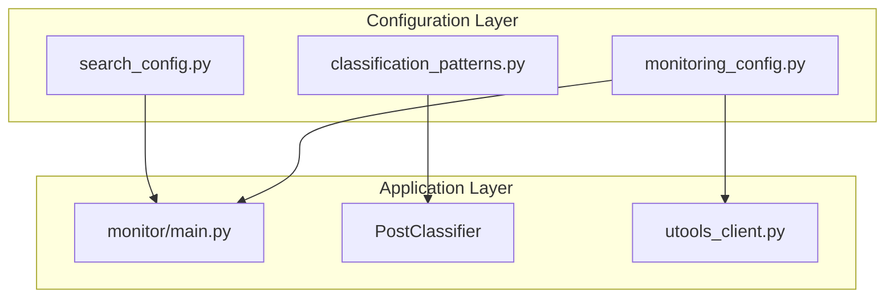

# Design Document

## Overview

This refactoring will reorganize the Comet Invitation Hunter codebase to centralize all search and processing strategies into easily configurable locations. Currently, search keywords, classification patterns, and monitoring parameters are scattered across multiple files, making strategy adjustments time-consuming and error-prone.

The design will create a centralized configuration approach where all strategy-related parameters are either:
1. Moved to dedicated configuration files
2. Placed at the top of relevant files in clearly marked sections
3. Consolidated into configuration classes

## Architecture

The refactoring will maintain the existing system architecture while reorganizing configuration:



## Components and Interfaces

### 1. Search Configuration (`backend/search_config.py`)
A new centralized configuration file containing all search-related parameters:

```python
# Search Keywords - Modify these to adjust search strategy
SEARCH_KEYWORDS = [
    "perplexity.ai/browser/claim",
    "comet invitation",
    "comet invite", 
    "comet browser invite",
    "comet access",
    "perplexity browser invite",
    "ai browser invite"
]

# Monitoring Parameters
MONITORING_INTERVAL = 300  # seconds
MAX_RESULTS_PER_KEYWORD = 200
SEARCH_PRODUCT = "Latest"
API_REQUEST_DELAY = 2  # seconds between keyword searches
```

### 2. Classification Patterns (`backend/classification_patterns.py`)
A new file containing all post classification rules:

```python
# Direct Invitation Link Patterns
INVITATION_PATTERNS = [
    r'https://www\.perplexity\.ai/browser/claim/[A-Z0-9]+',
    r'perplexity\.ai/browser/claim/[A-Z0-9]+',
    r'comet.*invitation',
    r'comet.*invite',
    r'comet.*access'
]

# Conditional Sharing Keywords
CONDITIONAL_KEYWORDS = [
    'dm me', 'send dm', 'direct message',
    'follow and dm', 'follow me and dm',
    'comment below', 'reply below',
    'retweet and dm', 'rt and dm',
    'follow for invite', 'follow to get',
    'like and dm', 'like and comment'
]

# Comet-related Keywords
COMET_KEYWORDS = [
    'comet', 'perplexity browser', 'ai browser',
    'perplexity.ai/browser', 'browser invite'
]
```

### 3. Updated Monitor Service (`monitor/main.py`)
The monitor will be refactored to import and use centralized configurations:

```python
# At the top of the file
import sys
import os
sys.path.append(os.path.join(os.path.dirname(__file__), '..', 'backend'))

from search_config import SEARCH_KEYWORDS, MONITORING_INTERVAL, MAX_RESULTS_PER_KEYWORD
from classification_patterns import INVITATION_PATTERNS, CONDITIONAL_KEYWORDS, COMET_KEYWORDS

class CometMonitor:
    def __init__(self):
        # Use imported configuration instead of hardcoded values
        self.search_keywords = SEARCH_KEYWORDS
        self.monitoring_interval = MONITORING_INTERVAL
        # ... rest of initialization
```

### 4. Updated Post Classifier
The PostClassifier will be refactored to use imported patterns:

```python
from classification_patterns import INVITATION_PATTERNS, CONDITIONAL_KEYWORDS, COMET_KEYWORDS

class PostClassifier:
    def __init__(self):
        # Use imported patterns instead of hardcoded class variables
        self.invitation_patterns = INVITATION_PATTERNS
        self.conditional_keywords = CONDITIONAL_KEYWORDS
        self.comet_keywords = COMET_KEYWORDS
```

## Data Models

No changes to existing database models are required. This is purely a code organization refactoring.

## Error Handling

The refactoring will maintain all existing error handling while adding:
- Import error handling for configuration files
- Validation of configuration parameters at startup
- Graceful fallback to default values if configuration is invalid

## Testing Strategy

### Unit Tests
- Test that configuration files can be imported successfully
- Verify that all configuration parameters are properly loaded
- Test that the system works with modified configuration values

### Integration Tests
- Test the complete monitoring cycle with new configuration structure
- Verify that changing configuration files affects system behavior as expected

### Backward Compatibility
- Ensure the refactored system produces identical results to the current implementation
- Test with various configuration combinations to ensure robustness

## Implementation Approach

### Phase 1: Create Configuration Files
1. Create `backend/search_config.py` with search keywords and monitoring parameters
2. Create `backend/classification_patterns.py` with all classification rules
3. Extract hardcoded values from existing files

### Phase 2: Update Import Structure
1. Modify `monitor/main.py` to import from configuration files
2. Update `PostClassifier` to use imported patterns
3. Update any other files that reference hardcoded values

### Phase 3: Add Configuration Comments
1. Add clear comments in configuration files explaining each parameter
2. Add inline comments showing where each configuration is used
3. Create a quick reference at the top of main files

## Configuration Locations Summary

After refactoring, configurable parameters will be located in:

1. **Search Keywords**: `backend/search_config.py` - `SEARCH_KEYWORDS` list
2. **Classification Patterns**: `backend/classification_patterns.py` - `INVITATION_PATTERNS`, `CONDITIONAL_KEYWORDS`, `COMET_KEYWORDS`
3. **Monitoring Parameters**: `backend/search_config.py` - `MONITORING_INTERVAL`, `MAX_RESULTS_PER_KEYWORD`, etc.
4. **API Configuration**: `backend/config.py` - existing API keys and URLs (no changes needed)

This approach provides a clear separation of concerns while making strategy adjustments as simple as editing a few configuration files.